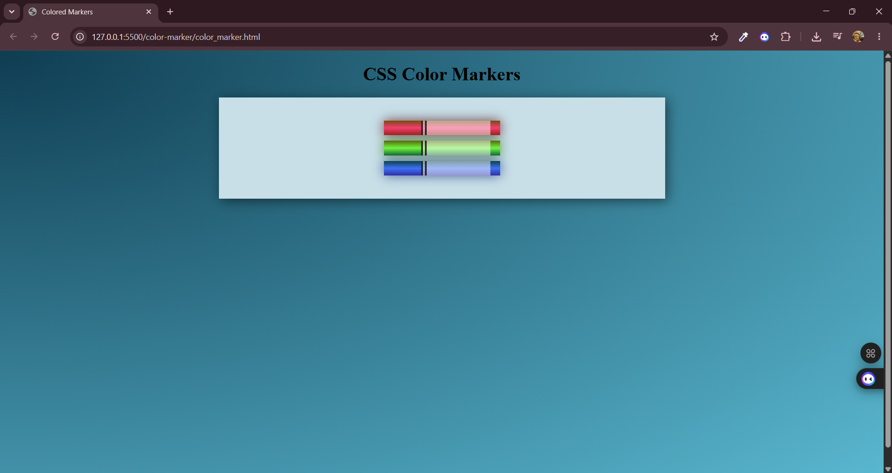

# CSS Color Markers

A FreeCodeCamp exercise showcasing CSS color gradients, shadows, and visual effects to create realistic 3D marker pen designs.

## 📋 Table of Contents

- [Overview](#overview)
- [Features](#features)
- [Screenshot](#screenshot)
- [Built With](#built-with)
- [What I Learned](#what-i-learned)
- [Author](#author)

## 🎯 Overview

This project demonstrates the power of CSS in creating visually appealing designs through the use of multiple color formats, gradient techniques, and shadow effects. Three marker pens (red, green, and blue) are rendered with realistic 3D depth using pure CSS styling, complemented by a sophisticated radial gradient background.

## ✨ Features

- **Multiple CSS Color Formats**: Demonstrates hex, RGB, HSL, and RGBA color values
- **Advanced Gradients**: Linear gradients for marker bodies and radial gradient for dynamic background
- **Realistic Shadows**: Box-shadow effects create depth and dimension
- **Responsive Design**: Clean, centered layout that adapts to viewport
- **Semantic HTML**: Properly structured markup for accessibility

## 📸 Screenshot

## 🛠️ Built With

- **HTML5**: Semantic markup structure
- **CSS3**: 
  - Radial-gradient and linear-gradient effects
  - Box-shadow for depth and lighting
  - Multiple color format systems (hex, RGB, HSL, RGBA)
  - CSS display properties (inline-block)
  - Flexbox and margin centering techniques

## 📚 What I Learned

- **Gradient Mastery**: Creating complex color gradients with multiple stops for realistic material representation
- **Color Formats**: Understanding when and how to use hex, RGB, HSL, and RGBA for different design needs
- **Shadow Effects**: Leveraging box-shadow to create depth and enhance visual hierarchy
- **Color Theory**: Selecting and combining complementary colors that work harmoniously together
- **Visual Depth**: Combining multiple CSS properties to create convincing 3D effects on 2D elements
- **Design Polish**: How small details like shadows and gradients elevate the overall visual presentation

## 👤 Author

**Blessed Atemgweye Efosa**

- **Instagram**: [@blessed_3fosa](https://www.instagram.com/blessed_3fosa/)
- **LinkedIn**: [@Blessed Atemgweye](https://www.linkedin.com/in/blessed-atemgweye-baba793a9/?lipi=urn%3Ali%3Apage%3Ad_flagship3_profile_view_base_contact_details%3B%2FwKNv421TmiNoRFWsgnzhw%3D%3D)

